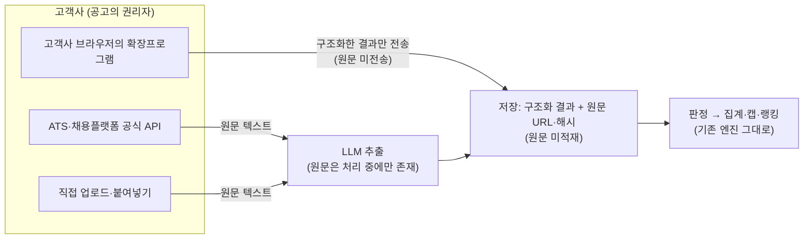
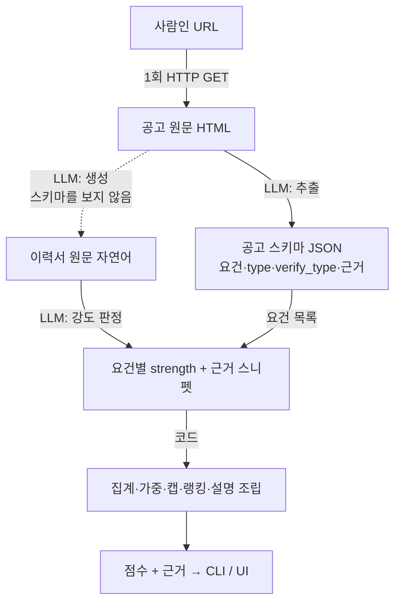

# 지원자·공고 매칭 스코어링 엔진

사람인 채용공고를 크롤링해 자격요건을 구조화하고, 지원자 풀과 매칭해 점수를 내 랭킹을 비교하는 엔진입니다.

**LLM은 의미 판정만 하고, 점수는 코드가 계산합니다.**

---

## 1. 실행 방법

### 1) 결과 확인 (API 키 불필요)

매칭 결과(`result/`)가 레포에 커밋돼 있어, 클론 후 바로 UI로 확인할 수 있습니다. 클론 없이 바로 보시려면 배포해 둔 화면도 있습니다: [job-match-scoring-engine.vercel.app](https://job-match-scoring-engine.vercel.app). 배포 화면은 커밋된 결과를 보여주는 용도이고, 매칭을 다시 실행하거나 새 공고를 수집한 결과는 로컬에서 확인해야 합니다.

```bash
git clone <repo-url> && cd job-match-scoring-engine
pnpm install
pnpm dev              # http://localhost:3000
```

공고를 고르면 랭킹 표가 뜨고, 지원자 행을 펼치면 요건별 충족 근거와 캡 적용 이유가 보입니다. 네이버(개발직)·스포카(PM) 두 공고의 결과가 들어 있습니다.

### 2) 매칭 재실행 (API 키 필요)

결과가 실제 스코어링 엔진을 통한 판정인지 확인하려면, 공고에서 추출한 결과 JSON으로 매칭을 다시 돌릴 수 있습니다.

```bash
cp .env.example .env    # .env 파일을 열어 OPENAI_API_KEY 입력
pnpm tsx scripts/match.ts --extracted extracted/54352607-naver-webtoon-disney-server.json
```

| 변수 | 기본값 | 용도 |
|---|---|---|
| `OPENAI_API_KEY` | (필수) | OpenAI 호출 키 |
| `OPENAI_JUDGE_MODEL` | `gpt-4o` | 요건 강도 판정 모델 |
| `OPENAI_EXTRACT_MODEL` | `gpt-4o` | 공고 추출 모델 (`--job` 모드에서만 사용) |

실행하면 `result/{slug}.json` 이 다시 만들어집니다. 랭킹의 밴드 구조(완벽 > 부분 > 캡)는 그대로 재현되고, 정성 판정이 갈리는 인접 순위는 실행마다 한 칸 정도 움직일 수 있습니다.

### 3) 테스트 (API 키 불필요)

```bash
pnpm test    # 하드코딩 부재 / 랭킹 순서 / 캡 / 결과 스냅샷
```

---

## 2. 요구사항별 구현

### 1. 채용 공고 크롤링

- **구현**: HTTP request만으로 공고 원문을 수집합니다. 최초 1회 받아 로컬에 두고 크롤러는 재실행하지 않습니다. 원문 HTML은 레포에 올리지 않고, 구조화해서 추출한 데이터만 커밋해뒀습니다.
- **공고 선택**: 서로 다른 두 직군이 필요했습니다. 첫 직군은 그룹바이에 공고가 많고 제가 개발자라 결과를 검증하기 가장 익숙한 개발 직군을 골랐고, 두 번째는 직군과 무관하게 동작하는지 확인하기 위해 비개발 직군 중 PM을 골랐습니다. 실제 공고는 Claude Code로 사람인에서 크롤링했을 때 조건이 텍스트로 잘 잡히는 것 위주로 후보를 수집한 뒤 그중에서 직접 정했습니다. 개발직은 [네이버웹툰 서버](https://www.saramin.co.kr/zf_user/jobs/relay/view?rec_idx=54352607), 비개발직은 [스포카 PM](https://www.saramin.co.kr/zf_user/jobs/relay/view?rec_idx=54335440)입니다.
- **문제/한계**: 사람인 공고는 구조가 제각각이었습니다. 채용 조건이 이미지에 담겨 텍스트가 거의 없는 공고도 있었고, 초기에 만든 크롤러로 전부 수집되는 공고가 있는가 하면 일부만 수집되는 공고도 있었습니다. 처음엔 이 문제를 해결해야 하나 잠시 고민했지만, 이 프로젝트의 핵심 목표는 JD와 이력서를 매칭하는 엔진을 만드는 것이라고 보고, 범용 크롤러를 만드는 대신 필수·우대 조건이 텍스트로 명확한 공고를 골랐습니다.

### 2. 공고 원문 → 조건 데이터 추출

- **구현**: 수집한 공고 원문을 LLM에게 넘겨, 각 문장이 지원자를 걸러내는 데 쓰이는 조건인지를 기준으로 **필수조건·우대사항·unknown** 세 가지로 나누게 구현했습니다. 동시에 이번 매칭에는 쓰이지 않지만 장기적으로 활용할 수 있는 회사 소개·주요 업무, 그리고 채용절차·복지처럼 버리지 않고 체계화해 모아둘 데이터도 함께 분류해뒀습니다.
- **문제**: JD 구조가 회사마다 전부 달랐습니다. 조건을 표현하는 헤더도 회사마다 달랐고, 어떤 회사엔 있는 정보가 다른 회사엔 없기도 했습니다. 조건 묶음이 헤더 없이 텍스트로 이어지면 분류가 확실하지 않아지기도 했습니다. 그래서 분류를 LLM에게 전부 맡겼을 때 정확하게 구분되지 않는 경우가 많았습니다.
- **해결**: 무조건 필수/우대 둘 중 하나로 나누면 잘못 분류될 확률이 큽니다. 추출한 조건은 곧바로 매칭에 쓰이므로, 확실하지 않은 것은 unknown으로 두고 근거가 분명한 조건 위주로 분류했습니다. LLM에게 분류를 시킬 때 각 조건이 얼마나 확실하게 분류되었는지를 **confidence**(0~1)로 기록하도록 했습니다. 분류 근거에 따라 값이 갈립니다.

  - 필수·우대를 명시하는 헤더('자격요건'·'우대사항'·'지원자격'·'필요요건' 등) 아래 있으면 → 약 **0.95**
  - 헤더 없이 문장 속 신호어('필수'·'있어야')로만 드러나면 → 약 **0.85**
  - 문장 어미로만 추측되는 정도면 → 약 **0.5**
  - 아무 신호가 없으면 unknown으로 두고 → **0.3 이하**

  이 confidence는 뒤 매칭 단계에서 확실한 조건만 엄격히 반영하는 기준이 됩니다.

### 3. 매칭 점수(0~100) + 랭킹

- **구현**: 매칭 점수는 지원자의 이력서 원문을 넣어, 공고의 각 조건을 얼마나 충족하는지 조건별로 판정한 뒤, 코드가 그 결과를 모아 0~100점으로 집계하고 점수순으로 랭킹을 매깁니다.

  점수를 내는 데는 세 가지를 설계에 넣었습니다.
  - 필수가 우대보다 중요하므로 필수(must)와 우대(nice)에 **7:3** 가중치를 뒀습니다.
  - 조건을 스킬·경력처럼 이력서에서 사실 여부를 분명히 확인할 수 있는 것과, 태도·성향처럼 정성적으로 판단해야 하는 것으로 나눕니다.
  - 필수를 못 채우면 점수를 깎는 대신 받을 수 있는 최대 점수에 상한을 둡니다.

  각 설계를 왜 이렇게 했는지는 아래 문제와 해결에서 다룹니다.
- **문제**: 점수를 내는 방식만으로는 세 가지 문제가 발생합니다.
  - 필수조건에 더 큰 가중치를 줘도, 필수를 하나 못 채운 지원자가 우대를 충분히 채우면 필수를 다 채운 지원자를 앞지를 수 있습니다. 가중치만으로는 서류에서 탈락할 가능성이 높은 사람이 상위에 오르는 걸 막지 못합니다.
  - 각 조건의 충족 여부는 LLM이 판정하는데, 스킬·경력 같은 실력 조건과 자기주도성·협업 태도 같은 성향 조건을 안정적으로 구분하지 못했습니다. 실력은 충분하지만 태도가 부족하게 설계된 지원자를 필수 조건 전부 충족으로 보기도 했습니다.
  - 조건 충족을 판정할 때 기준이 엄격하지 않으면, 조건에 직접 맞지 않고 관련만 있어도 충족으로 처리됩니다. 예를 들어 결제 연동 경험만 있는 지원자를 '대규모 모듈화를 주도했다'는 조건에 충족으로 보는 식입니다.
- **해결**: 문제마다 장치를 하나씩 뒀습니다.
  - **감점이 아니라 상한(캡).** 필수를 못 채우면 점수를 깎지 않고 받을 수 있는 최대 점수에 상한을 둡니다. 하나 못 채우면 상한이 59점, 둘 이상이면 39점이 되어, 필수를 다 채운 지원자와 확실히 구분됩니다. 60·40이 아니라 59·39인 건 캡 없이 정확히 60점이나 40점을 받은 지원자와 점수가 겹치지 않게 하기 위해서입니다. 0점으로 만들지 않는 건 미충족자끼리도 순위는 갈려야 하기 때문입니다.
  - **조건을 두 종류로 나누고, 캡은 확인되는 조건에만.** 스킬·경력처럼 사실로 확인되는 조건과, 태도·성향처럼 해석이 필요한 조건을 구분합니다. 해석이 필요한 조건은 LLM 판정이 흔들리므로, 되돌릴 수 없는 캡은 사실로 확인되는 조건이 빠졌을 때만 걸고 나머지는 감점으로만 반영합니다. 어떤 조건이 어느 쪽에 속하는지는 코드에 미리 정해두지 않고, 조건을 추출하는 단계에서 공고가 그 조건을 어떻게 서술했는지를 보고 LLM이 정합니다.
  - **충족을 네 단계로 판정.** 조건 충족을 '직접 충족·부분 충족·관련만 있음·없음'으로 나눠, 관련만 있는 것은 충족으로 세지 않습니다. 부분 충족은 직접과 없음 사이의 완충지대라, 애매한 근거를 억지로 충족·미충족 한쪽으로 몰지 않아 잘못 판정될 가능성을 줄입니다.

  여기에 더해, **이력서는 항목으로 쪼개지 않고 원문을 그대로 판정에 넣습니다.** 이력서는 연차·태도·경험이 문장 속 서사에 녹아 있어서, 공고처럼 항목으로 구조화하면 그 뉘앙스가 손실됩니다. 실제로 완벽하게 맞춰 설계한 이력서가 필수조건 6개 중 2개만 충족한 것으로 잘못 판정된 적이 있었는데, 원문을 그대로 넣으니 바로잡혔습니다.

### 4. 사람이 읽을 수 있는 매칭 근거

- **구현**: 각 조건마다 LLM이 충족 강도(직접 충족·부분 충족·관련만 있음·없음)와 그렇게 판단한 근거 문장을 함께 반환합니다. 코드는 이를 모아 "필수 3개 중 3개 충족" 같은 요약을 만들고, UI에서는 지원자마다 조건별로 펼쳐 어떤 근거로 충족·미충족됐는지 볼 수 있게 보여줍니다.
- **문제**: 근거의 충족 강도를 사람이 검증할 때, 조건과 관련만 있는 것과 실제로 충족한 것을 혼동하기 쉽습니다.
- **해결**: 충족을 '직접 충족·부분 충족·관련만 있음·없음' 네 단계로 표시합니다. 그래서 읽는 사람이 어떤 조건이 실제로 충족됐는지, 아니면 관련만 있어 충족으로 치지 않은 것인지를 LLM의 판정 그대로 눈으로 확인할 수 있습니다.

### 5. 직군 무관 일반화 (하드코딩 금지)

- **구현**: `src/` 코드에는 특정 스킬이나 직군 이름이 하나도 들어 있지 않습니다. 스킬·직군·도메인은 코드가 그 값이 무엇인지 해석하지 않고, LLM이 판정한 문자열을 그대로 주고받기만 합니다. "리액트"와 "React"를 같은 스킬로 볼지 같은 판단도 코드가 아니라 프롬프트에 맡겼습니다. 이렇게 하면 새로운 직군이 들어와도 코드를 고칠 필요가 없습니다.
- **검증**: 직군과 무관하게 동작하는지 두 가지 방식으로 확인했습니다. 하나는 코드에 특정 스킬이나 직군 이름이 섞여 들어가지 않았는지 자동으로 잡아내는 테스트이고, 다른 하나는 개발이 끝난 뒤 개발 중 한 번도 보지 않은 직군의 공고를 넣어 돌려보는 개발 방식 자체입니다.
- **해결**: 먼저 개발 직군(네이버) 공고와 이력서만으로 엔진을 완성했습니다. 두 번째 직군인 PM(스포카)은 개발이 끝날 때까지 의도적으로 참고하지 않았고, 완성된 뒤에야 넣어봤습니다. 코드를 한 줄도 고치지 않았는데 PM 공고에서도 개발 직군과 같은 순위 구조가 나왔습니다.

### 6. CLI 실행

- **구현**: 명령 하나로 공고 추출부터 지원자 판정, 점수 집계, 랭킹까지 한 번에 실행됩니다. 실행 방식은 두 가지로 만들어 뒀습니다. 하나는 공고 원문에서 추출부터 시작하는 방식으로 로컬 개발에 쓰고, 다른 하나는 이미 추출해둔 결과로 매칭만 다시 돌리는 방식으로, 원문이 없어도 채점자가 재현해 볼 수 있게 해뒀습니다.

### 7. 결과 확인 UI

- **구현**: 공고를 탭으로 고르면 지원자 랭킹 표가 뜹니다. 표에서 각 지원자의 점수, 필수·우대 충족 수, 그리고 캡이 걸렸다면 그 이유(어떤 필수를 못 채워 몇 점 상한인지)까지 바로 보입니다. 지원자 행을 누르면 왼쪽에는 조건별 판정(충족 강도를 직접·부분·관련만·없음 뱃지로, 확인 가능한 조건과 정성 판단 조건을 색으로 구분)과 근거 문장이, 오른쪽에는 그 판정의 출처인 이력서 원문이 나란히 펼쳐집니다. 점수가 왜 그렇게 나왔는지를 보여주는 데 집중했습니다.

### 8. 법적 우회 구조 (설계만)

코드는 없고 설계만 한 부분입니다. 서비스 제공사가 잡보드에서 직접 공고를 크롤링해 저장하면 잡보드 약관 위반과 DB 제작자 권리 문제가 생깁니다. 그래서 우리가 잡보드에서 가져오는 대신, **공고의 원저작자인 고객사(채용사)가 자기 공고를 우리에게 넣어주는 구조**로 잡았습니다.



**고객사를 거치는 유입 채널 세 가지**

- **공식 API 연동이 기본 경로입니다.** 고객사가 쓰는 ATS나 채용 플랫폼의 공식 API로 공고를 받습니다. 약관이 허용하는 경로 안에서 받는 것이라 리스크가 가장 적다고 생각했고, 공고 수정·마감 같은 상태 변화도 따라가기 좋습니다.
- **직접 업로드·붙여넣기는 연동 없이 시작하는 경로입니다.** 권리자인 고객사가 자기 공고를 직접 올리는 것이라 법적으로 가장 단순하고, 개발 없이 바로 쓸 수 있습니다.
- **브라우저 확장프로그램은 보조 수단입니다.** 고객사 담당자의 브라우저에 설치하는 확장입니다. 담당자가 잡보드에서 자기 회사 공고 페이지를 열면 확장이 그 화면의 내용을 읽어 파싱하고, 원문이 아니라 구조화한 결과만 서버로 보냅니다. 수집이 우리 서버가 아니라 권리자인 고객사의 브라우저에서 일어난다는 점이 이 과제의 크롤러와 다릅니다. 위 두 경로를 쓸 수 없을 때 커버하는 용도입니다.

결국 이 엔진이 필요로 하는 입력은 비정형 원문 텍스트 하나라서, 받는 채널이 무엇이든 그 뒤의 추출·판정·집계는 달라지지 않습니다. 지금 코드에서도 크롤러는 매칭 파이프라인 밖에 분리돼 있고, 매칭은 추출 결과(`extracted/`)에서 시작합니다.

**저장과 동의**

- **저장 최소화**: 서비스에 실제로 필요한 것은 구조화한 결과라서, 기본은 구조화 결과와 원문 URL, 원문 해시만 보관하는 쪽으로 잡았습니다. 고객사가 원문 보관까지 원한다면 계약에 따라 저장할 수도 있다고 생각합니다. 다만 잡보드 화면에서 수집하는 경우는 공고 내용 외에 잡보드 쪽 요소가 섞여 있을 수 있어, 원문을 남기지 않는 쪽이 안전하다고 봤습니다. 해시는 원문 없이도 어느 원문에서 나온 결과인지 확인하는 용도입니다. 이 레포도 같은 원칙으로 원문 HTML은 커밋하지 않고, 추출 JSON만 커밋해뒀습니다.
- **동의와 기록**: 이용약관에 "귀사는 게시 공고에 대한 권리를 보유하며 그 처리를 위탁한다"를 두고, 수집 주체와 시각, 동의 근거를 로그로 남깁니다.

**한계**: 브라우저 확장 방식은 고객사가 자기 공고를 가져오는 것이라도, 잡보드 약관이 자동화 수집을 금지하고 있다면 약관 위반이 될 수 있습니다. 그렇기 때문에 공식 API를 기본 경로로 두고 확장은 보조로 둡니다.

### 목업 이력서 설계

요건에 직접 해당하진 않지만, 매칭의 입력이 되는 중요한 부분이라 여기서 함께 설명합니다. 공고에서 추출한 스키마를 그대로 넣어 이력서를 생성하면 자기가 낸 문제를 자기가 푸는 셈이 되므로, 생성할 때는 공고 원문과 페르소나만 넣고 추출한 스키마는 넣지 않았습니다.

키워드가 아니라 의미로 판정되는지 확인하려고, 공고의 표현을 일부러 조금씩 다르게 쓰고 무관한 경력 같은 노이즈도 섞었습니다.

페르소나는 유형별로 나눠 직접 자연어로 작성해 전달했습니다.

- **완벽 매칭**: 필수·우대 조건을 전부 충족
- **부분 매칭**: 필수는 전부 충족하되 우대가 부족 / 필수 중 정성 조건이 약함 / 필수 중 검증가능 조건을 채우지 못함
- **미스매칭**: 표면 키워드는 겹치지만 실질은 미달

---

## 3. 아키텍처 — LLM과 코드의 경계



|  | 담당 | 이유 |
|---|---|---|
| **LLM** | 의미 판정만 — 공고 원문→구조화, 이력서 원문→강도 판정(충족 여부 + 근거 문장) | 도메인 지식이 필요. 사전으로 커버 불가 |
| **코드** | 집계·가중·캡·랭킹·설명 조립 | 결정론적. 테스트·근거추적 가능 |

LLM에게 점수 산정까지 맡기면 결과가 그때그때 달라질 수 있고, 왜 그 점수인지 이유를 추적하기도 어렵습니다. 그래서 점수는 코드가 계산하도록 구현하고, LLM은 그 계산에 필요한 분류(조건별 충족 강도와 근거)에만 사용했습니다.

### 프로젝트 구조

```
src/
  crawler/      사람인 HTTP 크롤 + 본문 추출 (헤드리스 브라우저 금지)
  llm/          OpenAI 어댑터(provider 교체 가능) + 프롬프트 해시 캐시
  extraction/   공고 원문 → 구조화 요건  (schema · extract · prompt)
  matching/     요건 × 이력서 원문 → 충족 강도 판정 (judge)
  scoring/      집계 · 캡 · 랭킹  (aggregate — 순수 함수)
  app/          결과 UI (Next.js App Router)
scripts/        CLI 진입점 match.ts · 수집·생성 개발 도구
prompts/        LLM 지시문 (코드 밖 데이터: extract_job · judge · generate_resume)
fixtures/       공고 원문 HTML (미커밋 — 사람인 DB권)
extracted/      공고에서 추출한 결과 JSON (커밋 — 매칭 재실행 입력)
data/resumes/   목업 이력서 (개발직 6명 + PM 6명)
result/         공고별 매칭 결과 JSON (UI 입력·커밋)
cache/          LLM 응답 캐시 (미커밋 — 실행하면 생성)
tests/          하드코딩 부재 · 랭킹 순서 · 캡 · 결과 스냅샷 + 응답 픽스처
```

같은 입력의 LLM 호출은 저장해둔 응답을 다시 씁니다(프롬프트 해시 캐시). 개발 중에는 같은 공고·이력서 조합을 수십 번 반복 실행하게 되는데, 제공된 예산 안에서 실험하고 같은 입력에는 같은 결과가 나오게 하려고 넣었습니다. 캐시는 로컬 생성물이라 커밋하지 않으므로, 클론 직후 첫 재실행은 실제 호출이고 그 뒤 반복부터 캐시를 씁니다. LLM 호출부는 하나의 어댑터로 감싸 둬서, OpenAI를 다른 provider로 바꿔도 나머지 계층은 그대로입니다.

---

## 4. 테스트 코드

테스트는 전체를 커버하기보다, 이 시스템에서 무엇을 검증할 수 있고 무엇은 검증할 수 없는지를 나누는 데 초점을 뒀습니다.

LLM 판정은 같은 입력이라도 결과가 조금씩 달라질 수 있어서, 정확한 점수를 정해두는 테스트는 만들 수 없습니다. 그 점수가 맞는지 확신할 수 없고, 프롬프트를 조금만 바꿔도 달라지기 때문입니다. 그래서 검증할 수 있는 부분과 없는 부분을 나눠서 다뤘습니다.

- LLM 판정처럼 매번 달라질 수 있는 부분은, 테스트에서는 실제로 호출하지 않고 미리 저장해둔 응답으로 대신합니다.
- 그 뒤 코드가 하는 계산(캡·집계)은 결과가 항상 같으니 정확한 값으로 확인합니다.
- 순위는 정확한 점수 값이 아니라, 누가 누구보다 위여야 하는지의 순서로 확인합니다.

이 원칙에 따라 네 가지를 골랐습니다.

- **하드코딩 부재 검사**: `src/` 코드에 특정 스킬이나 직군 이름이 섞이지 않았는지 검사합니다. 직군과 무관하게 동작하는지 검증하기 위한 것으로, 나중에 코드에 특정 스킬 이름이 들어가면 바로 걸립니다.
- **랭킹 순서 검증**: 정성 매칭에 정답 점수는 없지만 정답 순서는 있습니다. 완벽 매칭은 미스매칭과 캡이 걸린 지원자 전원보다 위에 있어야 하고, 캡이 걸린 지원자는 자신의 상한을 넘지 못합니다. 실제 파이프라인 결과로 이 순서를 확인합니다.
- **캡 계산 검증**: 감점 대신 상한을 씌우는 규칙이 코드에 실제로 있는지, 판정값을 직접 넣어 확인합니다. 테스트로 확인해두지 않으면 이 규칙이 제대로 작동하는지 알기 어렵기 때문입니다. 정성 조건 미충족을 감점으로만 반영하는 경우도 여기서 확인합니다.
- **결과 스냅샷 비교**: LLM 응답만 미리 저장된 값으로 대신하면 그 뒤 파이프라인(추출 파싱부터 집계·캡·근거 조립까지)은 항상 같은 결과가 나옵니다. 그 결과를 저장해두고, 코드를 고쳤을 때 결과가 달라지지 않는지 비교합니다. 테스트가 네트워크나 API 키, 과금에 의존하면 안 되므로 LLM 호출만 저장된 값으로 대신했습니다.

---

## 5. 아쉬운 점과 더 해보고 싶은 것

- **연차 적합도 판정**: 지금은 "3년 이상" 같은 조건을 충족하는지(하한)만 봅니다. 하지만 3년차를 뽑는 자리에 10년차가 지원하면 오히려 잘 맞지 않을 수 있는데, 모집하는 연차에 얼마나 가까운지까지 판정하는 건 넣으려다 미뤘습니다. 이번에는 조건을 확실히 분류하고 판정하는 것을 먼저 완성하는 게 목표라고 봤기 때문입니다. 실제로 상한이 있는 요건(경력 2년 이상 5년 이하)에서 6년차 이력서가 충족으로 판정된 사례가 있었는데, 연차처럼 숫자로 확인할 수 있는 조건은 LLM 판정에 맡기지 않고 추출해둔 숫자를 코드로 직접 검증하는 것이 다음 단계라고 봅니다.
- **정성 판정의 한계**: 좋은 모델을 써도 태도·성향 판정에는 오류가 남습니다(소극적인 서술을 부분 충족으로 높게 보는 등). 정성 판정은 완벽하게 하기가 어려운 만큼, 판정 기준을 바꿔가며 정확도를 조금씩 높여가야 하는 부분이라고 봅니다. 지금은 정성 조건을 상한(캡)에서 빼고 감점으로만 반영하고 있습니다. 캐시 없이 세 번 다시 실행해 보니 사실로 확인되는 조건의 판정은 매번 같았고 정성 조건의 판정만 일부 달라져서, 정성 조건을 캡에서 빼길 잘했다고 생각한 부분이기도 합니다.
- **필수·우대 외 정보 활용**: 매칭은 지금 필수·우대 조건만 쓰지만, 주요업무·회사소개나 조건의 성격 분류 같은 정보도 함께 추출해 저장해뒀습니다. 이런 정보까지 활용해서 매칭을 더 정교하게 만드는 방향을 찾아보고 싶습니다.
- **서류 합격 기록으로 회사별 기준 찾기**: 지금 엔진은 필수조건을 가장 중요한 조건으로 봅니다. 실제로도 그럴 확률이 높지만, 우대사항을 아주 잘 충족한 지원자라면 필수 일부가 부족해도 서류를 통과시키는 회사가 있을 수 있습니다. 이건 JD만으로는 판단할 수 없는 부분입니다. 서비스에 회사별 서류 합격 기록이 쌓이면, 그 회사가 주로 어떤 이력서를 통과시키는지 분석해서 회사가 중요하게 보는 기준을 찾아내고 랭킹에 반영해보고 싶습니다.
- **다른 회사 JD와 비교해 강조점 찾기**: 지금은 공고 하나 안에서만 분석하지만, 여러 회사의 JD가 쌓여 있다면 이 JD가 다른 JD들과 어디가 다른지 비교해서 이 공고가 특별히 강조하는 가치를 찾아낼 수 있을 것 같습니다. 공고에서 직접 추출한 조건 외에 회사가 특별히 중요하게 생각하는 가치까지 찾아낼 수 있다면, 위의 합격 기록 분석과 함께 회사별 매칭을 더 정교하게 만드는 재료가 될 거라고 봅니다.

---

## 6. 과제하며 든 생각

처음에는 전체를 잘 구현해보려 했지만, 기간 안에 완벽한 분류를 해내는 엔진을 만드는 것이 목표인 과제는 아니라고 생각하게 되면서, 무엇을 먼저 할지 정하는 게 가장 중요했던 것 같습니다. 그래서 가장 핵심이 되는 매칭 스코어링 엔진을 제대로 동작하게 만드는 쪽에 집중했습니다. 엔진을 테스트할 이력서 목데이터도 정교하게 다듬으면 좋았겠지만, 거기까지 시간을 쓰기보다는 완성도가 아주 높진 않아도 엔진이 어느 정도 돌아가는 수준을 만드는 걸 우선했습니다.

이력서와 공고를 분석하다 보니 정성적으로 판단해야 하는 부분이 생각보다 많다는 걸 알았습니다. 이걸 얼마나 사람처럼 잘 분석해내느냐가 매칭 정확도를 높이는 지점이 될 것 같습니다. 특히 요즘은 어떤 기술을 다룰 수 있느냐보다 AI를 얼마나 잘 활용하는지, 그리고 태도나 가치관 같은 정성적인 면이 점점 더 중요해지는 시대라, 이런 부분을 잘 판정해내는 것이 앞으로 더 중요한 포인트가 될 것 같습니다.

짧은 시간이었지만 그룹바이가 중점적으로 다루는 기술과 그 어려움을 빠르게 체감했고, 왜 그룹바이의 제품이 지금처럼 구성돼 있는지도 더 잘 이해하게 됐습니다.
